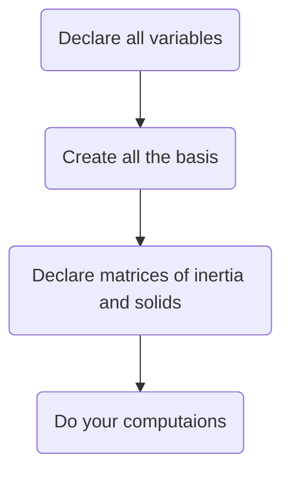

[TOC]

# GENERAL DESCRIPTION

M3C4n'X is the perfect tool for mechanics.
You can do things like shift wrenches or inertia matrices, express anything in any basis.

You'll see it's pretty cool...

# COMMANDS

## AFFECTATION

```apl
variable = value
```

## DECLARATION

### Scalar

```apl
scalar
```

### Vector

```apl
x , y , z , basis
```
for example:
```apl
a , 0 , b , 2
```

**or**

```apl
value / basis_vector
```
for example:
```apl
l / y1
```

### Wrench 

```apl
sum ; moment
```
(sum and moment being vectors)

for example:
```apl
a,b,c,0 ; MA32
```

### Basis / Matrix / Variables

Have a look at the buttons


##  OPERATION
|Operation|Symbol|
| ----- | ------- |
| Plus  | ```+``` |
| Minus |      ```-```   |
|    Dot product   |     ```.```    |
|      Cross product |     ```*```    |
|   Shift    |    ```->```     |
|     Express in a basis  |     ```in```    |
|     Differentiate with respect to  |   ```diff```      |

==REMARK :==

You can use affectation, declaration and operation all together.

#  TIPS

You should proceed in the following order:



